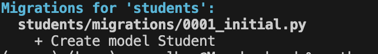

# Masomo School Management System

📚 Masomo is an open‑source game‑changing school management system designed to digitalize schools in African contexts, with a pilot blueprint in [Bukavu](https://en.wikipedia.org/wiki/Bukavu) & [Goma](https://en.wikipedia.org/wiki/Goma), [Democratic Republic of Congo] (https://en.wikipedia.org/wiki/Democratic_Republic_of_the_Congo) . Our mission is to equip students and teachers with digital materials, Internet access, and ICT training, bridging the educational technology gap in underserved regions.


## ✨ Features (Implemented so far)

* **Student CRUD**: Create, Read (List & Detail by slug), Update, and Delete student records via web forms with confirmation prompts.

* **Slug-based URLs**: Human-readable URLs like /student/alice-smith-somo/ generated automatically for each student.

* **Date Picker**: Integrated django-flatpickr for selecting date of birth with DatePickerInput and validation.

* **Registration Timestamp**: registration_date auto-logged via DateTimeField(auto_now_add=True).

* **Shared Layout**: Centralised `base.html` for consistent header, navigation (including Login/Logout), footer, and responsive design.

* **Authentication**: Login and Logout views protecting all student-management pages with @login_required.

* **Responsive Design**: Flex-based layout with media queries for mobile-friendly navigation and sticky footer.

* **Static Asset Management**: CSS, JavaScript, and images served via Django's staticfiles.

* **SQLite Database**: Lightweight local database, migrations configured.

## ⚙️ Tech Stack

* **Backend**: Django 5.1.5
* **Frontend**: HTML5, Tailwind-inspired CSS (custom `styles.css`), vanilla JavaScript
* **Database**: SQLite (development)

## 🚀 Getting Started

### 📋 Prerequisites

* Python 3.10+ (tested on 3.12)
* pip
* (Optional) Virtual environment tool: `venv` or `virtualenv`

### 📥 Installation

1. **Clone the repository**:

   ```bash
   git clone https://github.com/MarcelBag/masomo
   ```

2. **Create & activate a virtual environment**:

   ```bash
   python3 -m venv .venv
   source .venv/bin/activate  # Windows: .venv\Scripts\activate
   ```

3. **Install dependencies**:

   ```bash
   pip install --upgrade pip
   pip install -r ../requirements.txt
   ```

4. **Configure environment variables**

   Copy `.env.example` (if provided) to `.env` and fill in secrets. We recommend keeping sensitive keys out of source control. Our `.gitignore` excludes common secrets files.

5. **Run migrations**:

   ```bash
   python manage.py makemigrations
   python manage.py migrate
   python manage.py makemigrations teachers
   python manage.py makemigrations teachers
   python manage.py migrate

   ```
   ```
   rm -rf students/migrations

   ``` 
   just in case you want to delete something

6. **Collect static files** (for production):

   ```bash
   python manage.py collectstatic --noinput
   ```
7. **Create a superuser to be able to log in and manage students**:
    masomo/backend/

   ```bash
   python manage.py createsuperuser
   ```

8. **Run the development server**:

   ```bash
   python manage.py runserver
   ```
9. **Access the app**: Open `http://127.0.0.1:8000/` in your browser.

 accssing Django admin panel from /admin

10. **Access the app**: Open `http://127.0.0.1:8000/admin/` in your browser.

## 📁 Project Structure

```
Masomo/masomo
├── backend
│   ├── manage.py
│   ├── db.sqlite3
│   ├── masomo_config
│   │   ├── settings.py
│   │   └── urls.py
│   ├── students
│   │   ├── migrations/
│   │   ├── templates
│   │   │   ├── student_list.html
│   │   │   ├── add_student.html
│   │   │   ├── student_delete_confirm.html
│   │   │   └── student_edit.html
│   │   ├── forms.py
│   │   ├── models.py
│   │   ├── urls.py
│   │   └── views.py
│   └── teachers
│       ├── migrations/
│       ├── templates/
│       │   └── teachers/
│       │       ├── teacher_list.html
│       │       ├── add_teacher.html
│       │       ├── teacher_detail.html
│       │       ├── teacher_edit.html
│       │       └── teacher_delete_confirm.html
│       ├── forms.py
│       ├── models.py
│       ├── urls.py
│       └── views.py
├── frontend
│   ├── css/styles.css
│   ├── js/scripts.js
│   └── templates
│       ├── base.html
│       ├── Gestionduneecole.html
│       ├── index.html
│       ├── login.html
│       ├── student_detail.html
│       ├── student_edit.html
│       └── student_list.html
├── .gitignore
├── package.json
└── requirements.txt

```

## Usage

* **Home**: Landing page (`/`)
* **Étudiants**: List all students (`/student_list/`)
* **Add Student**: Add a new student (`/add_student/`)
* **Detail / Edit**: Click a name in the list to view details and edit.

## Next Steps

* **Delete** functionality with confirmation dialog
* **Authentication & Permissions** (Admin vs Staff)
* **Search, Filtering & Pagination** for student lists
* **Reports & Exports** (CSV/PDF)
* **Multi-language Support (i18n)**
* **Docker & Production Deployment**

## Contributing

Contributions welcome! Please fork the repo, create a feature branch, and open a pull request.

## License

Released under the MIT License. See `LICENSE` for details.

---

*Masomo is a project dedicated to empowering African educators and students through technology.*


